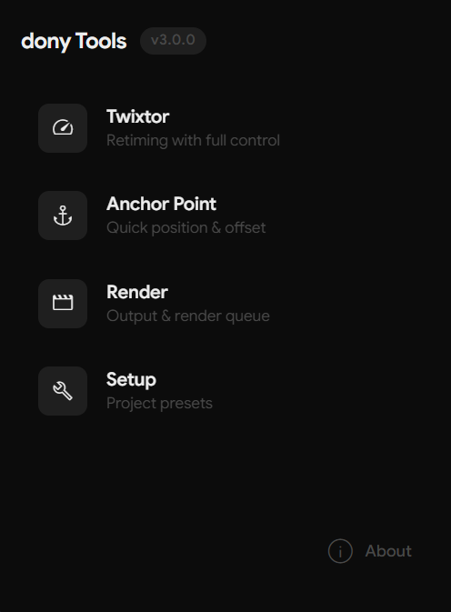

# dony Tools para Adobe After Effects



## Descripción

dony Tools es un completo kit de herramientas diseñado para Adobe After Effects, que proporciona un conjunto de utilidades para mejorar tu flujo de trabajo y aumentar la productividad. Esta extensión incluye módulos para la automatización de Twixtor Pro, la gestión de puntos de anclaje, la optimización de la configuración de renderizado y la configuración eficiente de proyectos. Tanto si eres un principiante como un usuario avanzado, dony Tools ofrece una gama de funciones para agilizar tu experiencia en After Effects.

## Versión Actual

**v3.0.0** - Rediseño Mayor y Migración a React

Para un historial detallado de todos los cambios, consulta el [Registro de Cambios](CHANGELOG_es.md).

## Instalación

1. **Descarga la Extensión:**
   - Descarga la última versión desde el sitio web oficial o repositorio.

2. **Instala la Extensión:**
   - Para Windows: Copia la carpeta a `C:\Program Files (x86)\Common Files\Adobe\CEP\extensions\`
   - Para Mac: Copia la carpeta a `/Library/Application Support/Adobe/CEP/extensions/`
   
   Nota: Es posible que necesites crear la carpeta extensions si no existe.

3. **Habilitar la Carga de Extensiones No Firmadas (si es necesario):**
   - Para Windows: Simplemente haz doble clic en el archivo `Add Keys.reg` incluido para añadir automáticamente la clave de registro requerida.
   - Para Mac: En la Terminal, ejecuta:
     ```
     defaults write com.adobe.CSXS.11 PlayerDebugMode 1
     ```

4. **Accede a la Extensión en After Effects:**
   - Abre Adobe After Effects
   - Navega a `Ventana > Extensiones > dony Tools` para ejecutar el panel

## Características Principales

### Tab Twixtor Pro

- **Control de Velocidad:**
    - Ajusta la velocidad de tu material de archivo usando Twixtor Pro.
    - Introduce el porcentaje de velocidad deseado (por ejemplo, 50 para la mitad de velocidad, 200 para el doble de velocidad).
    - Aplica Twixtor Pro con la configuración optimizada a la capa seleccionada.
    - **Modo Batch:** Aplica Twixtor a todas las capas seleccionadas simultáneamente mediante un checkbox.
    - **Colocación de fotogramas clave mejorada:** El script ahora calcula dinámicamente la duración del fotograma de la composición activa para un posicionamiento más preciso de los fotogramas clave.

### Tab Anchor Point

- **Posicionamiento Rápido del Punto de Anclaje:**
    - Mueve el punto de anclaje a posiciones predefinidas: arriba a la izquierda, arriba al centro, arriba a la derecha, centro izquierda, centro, centro derecha, abajo a la izquierda, abajo al centro, abajo a la derecha.
    - Iconos visuales para una manipulación intuitiva del punto de anclaje.
- **Ajuste de Desplazamiento:**
    - Ajusta con precisión la posición del punto de anclaje con los controles de desplazamiento X e Y.
- **Opciones de Restablecimiento:**
    - Restablece el punto de anclaje al centro de la capa.
    - Restablece los valores de desplazamiento a cero.
- **Soporte Multicapa:**
    - Aplica ajustes de punto de anclaje a múltiples capas seleccionadas simultáneamente.
- **Cálculo de Límites:**
    - Calcula con precisión los límites de múltiples capas para un posicionamiento preciso del punto de anclaje.
- **Nuevo Layout Organizado:**
    - Panel Position Control para botones de posicionamiento del punto de anclaje
    - Panel Offset Control para ajustes precisos
    - Organización vertical mejorada para un mejor flujo de trabajo

### Tab Render Settings

- **Selección del Módulo de Salida:**
    - Elige entre una lista de módulos de salida disponibles.
    - Actualiza la lista para obtener las últimas opciones del módulo de salida.
    - Funcionalidad de búsqueda para encontrar rápidamente el módulo de salida correcto.
- **Gestión de la Cola de Renderizado:**
    - Añade la composición actual a la cola de renderizado con un solo clic.
    - Opcionalmente, inicia el renderizado automáticamente después de añadir a la cola.
- **Extensión de Archivo y Filtro:**
    - Determina automáticamente la extensión de archivo y el filtro en función del formato de salida seleccionado.
- **Diálogo de Guardado Fácil de Usar:**
    - Proporciona un diálogo de guardado estándar para especificar la ubicación y el nombre del archivo de salida.
- **Acceso a Ubicación de Settings:**
    - Botón de acceso rápido para abrir la carpeta que contiene los settings de módulos de salida
    - Acceso directo a los archivos de configuración JSON

### Tab Setup

- **Configuraciones de Proyecto Predefinidas:**
    - Crea configuraciones de proyecto predeterminadas con resoluciones y estructuras de carpetas estándar:
        - **16:9:** resolución 1920x1080
        - **1:1:** resolución 1080x1080
        - **4:3:** resolución 1600x1080
    - Incluye carpetas estándar: Comps, Main Comps, Materials, Clips, Episodes.
- **Configuración de Proyecto Personalizada:**
    - Abre una ventana dedicada para crear configuraciones de proyecto personalizadas.
    - Define el ancho, alto, FPS, duración, número de composiciones y carpetas personalizados.
    - Nombra tus composiciones y asígnalas a carpetas específicas.
    - Guarda y carga ajustes preestablecidos personalizados para usarlos en el futuro.
- **Gestión de Ajustes Preestablecidos:**
    - Carga y elimina ajustes preestablecidos personalizados guardados.
    - Funcionalidad de búsqueda para encontrar presets rápidamente.
- **Gestión de Presets:**
    - Acceso rápido a la carpeta de presets del proyecto
    - Fácil gestión de configuraciones guardadas del proyecto

### Tab About

- **Información y Créditos:**
    - Muestra la versión de la extensión y la información del autor.
    - Proporciona una breve descripción de las características del kit de herramientas.
- **Enlace al Sitio Web:**
    - Botón para visitar el sitio web del autor para obtener más información, actualizaciones, contacto y sugerencias. El botón está etiquetado como "Visit Website".

## Uso

1. **Abre Adobe After Effects.**
2. **Ejecuta el Panel dony Tools:**
    - Ve a `Ventana > Extensiones > dony Tools`.
3. **Menú Desplegable del Panel (Flyout Menu):**
    - Accede al menú desplegable del panel (normalmente tres líneas horizontales) para opciones como refrescar la extensión o abrir la documentación.
4. **Navegar:**
    - La extensión utiliza un panel Home. Toca cualquier tarjeta de función para navegar a esa herramienta, y usa el botón atrás para volver al inicio.
4. **Twixtor Pro:**
    - Selecciona una capa en tu composición.
    - Introduce el porcentaje de velocidad deseado en el campo `Speed Input`.
    - Opcionalmente, marca `Apply to all selected layers` para activar el modo batch.
    - Haz clic en `Apply Twixtor Pro` para precomponer la(s) capa(s) y aplicar el efecto.
5. **Punto de Anclaje:**
    - Selecciona una o más capas.
    - Haz clic en el botón de posición del punto de anclaje deseado (por ejemplo, arriba a la izquierda, centro, abajo a la derecha).
    - Opcionalmente, ajusta los valores `Offset X` y `Offset Y`.
    - Haz clic en `Reset Anchor` para centrar el punto de anclaje o `Reset Offset` para borrar los valores de desplazamiento.
6. **Ajustes de Renderizado:**
    - Selecciona un módulo de salida de la lista desplegable.
    - Haz clic en `Refresh` para actualizar la lista si es necesario.
    - Haz clic en `Add to Render Queue` para añadir la composición actual a la cola de renderizado con la configuración seleccionada.
    - Marca `Auto Render` para iniciar el renderizado inmediatamente después de añadir a la cola.
7. **Configuración:**
    - Haz clic en un botón de ajuste preestablecido (**16:9, 1:1 o 4:3**) para crear un proyecto con la configuración predeterminada.
    - Haz clic en `Open Custom Setup` para crear un proyecto con una configuración personalizada.
    - En la ventana de configuración personalizada:
        - Introduce el ancho, alto, FPS, duración, número de composiciones y carpetas deseados.
        - Haz clic en `Save Preset` para guardar tu configuración como un ajuste preestablecido.
        - Haz clic en `Create Custom Setup` para crear el proyecto.
8. **Acerca de:**
    - Haz clic en la pestaña `About` para ver la información de la extensión y visitar el sitio web del autor.
9. **Tooltips:**
    - Pasa el ratón por encima de cualquier botón o elemento de la interfaz para ver una descripción detallada de su función.

## Ventana de Configuración Personalizada

### Características

- **Cargar Ajuste Preestablecido:**
    - Selecciona un ajuste preestablecido guardado previamente de la lista desplegable.
    - Funcionalidad de búsqueda para encontrar presets fácilmente.
    - Haz clic en `Load` para rellenar los campos de configuración con los valores preestablecidos.
    - Haz clic en el botón del icono de refresco para recargar manualmente los presets del archivo.
- **Eliminar Ajuste Preestablecido:**
    - Selecciona un ajuste preestablecido de la lista desplegable.
    - Haz clic en `Delete` para eliminar permanentemente el ajuste preestablecido.
- **Dimensiones:**
    - Introduce el ancho y el alto deseados en píxeles.
    - Selecciona entre los ajustes preestablecidos de resolución comunes en la lista desplegable con funcionalidad de búsqueda.
- **Duración:**
    - Establece los fotogramas por segundo (FPS) manualmente o elige entre los ajustes preestablecidos de FPS comunes.
    - Funcionalidad de búsqueda para encontrar rápidamente valores específicos de FPS.
    - Especifica la duración en horas, minutos y segundos.
- **Composiciones:**
    - Introduce el número de composiciones a crear.
    - Haz clic en el botón `+` para personalizar los nombres de las composiciones y asignarlas a carpetas específicas.
- **Carpetas:**
    - Añade y elimina carpetas usando la lista interactiva con los botones `+` y `×`.
- **Guardar Ajuste Preestablecido:**
    - Introduce un nombre para tu ajuste preestablecido.
    - Haz clic en `Save Preset` para guardar la configuración actual. Aparece un diálogo de confirmación si ya existe un preset con el mismo nombre.
- **Acciones:**
    - Haz clic en `Reset to Default` para revertir todos los ajustes a sus valores predeterminados.
    - Haz clic en `Create Custom Setup` para crear el proyecto con la configuración especificada.

## Notas

- La extensión guarda automáticamente la configuración del módulo de salida y los ajustes preestablecidos personalizados en archivos JSON en la carpeta de documentos de usuario en `Adobe/dony Tools Data`.
- El diseño responsivo asegura que la extensión funcione bien en diferentes tamaños de panel y resoluciones de pantalla.
- Todos los menús desplegables (presets, resoluciones, valores de FPS y módulos de salida) incluyen funcionalidad de búsqueda para un acceso rápido.

## Compatibilidad

Esta extensión está diseñada para ser compatible con **Adobe After Effects CC 2018 (versión 15.0) y versiones posteriores**, hasta After Effects 2026. Utiliza CEP (Common Extensibility Platform) con soporte para el runtime CSXS 8.

> **Nota:** Adobe está migrando gradualmente de CEP a UXP. CEP sigue siendo completamente compatible con After Effects 2026, pero podría ser retirado en versiones futuras.

## Soporte

Si necesitas ayuda o quieres hacer algún comentario, puedes contactarme aquí:

[https://donyaep.vercel.app/](https://donyaep.vercel.app/)

¡Disfruta usando dony Tools y mejora tu flujo de trabajo en After Effects! :>